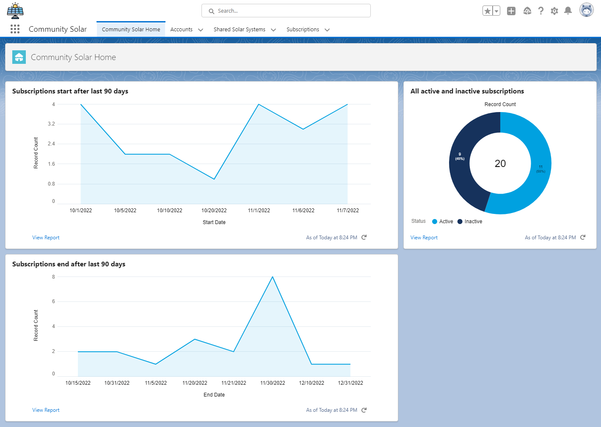
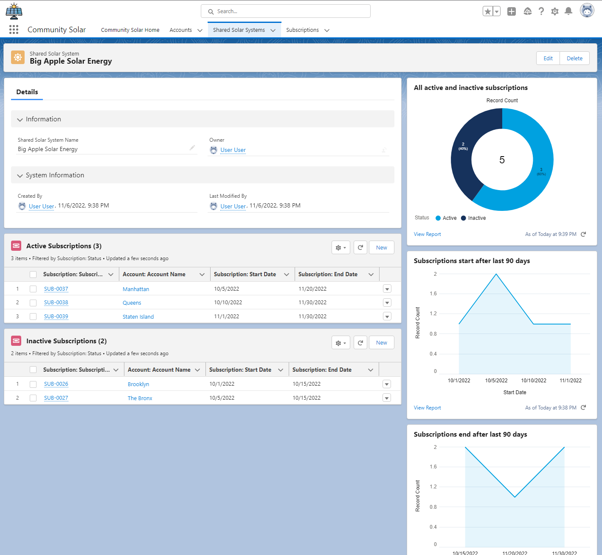

# Community Solar

Sample application to demonstrate subscriptions, validation of subscription
dates, and reports with chart to track start dates and end dates.





## Installation Instructions

This section assumes that a devhub org is setup and sfdc cli is installed. The
commands listed here should be issued on git bash or similar terminal, Command
Prompt or PowerShell will not work without modification.

### Create Scratch Org

```
sfdx force:org:create \
--wait 60 \
--durationdays=30 \
--definitionfile config/project-scratch-def.json \
--setalias SCRATCH_ORG_USERNAME_OR_ALIAS \
--targetdevhubusername DEVHUB_USERNAME_OR_ALIAS
```

### Deploy Source Code to Scratch Org

```
sfdx force:source:push --targetusername SCRATCH_ORG_USERNAME_OR_ALIAS
```

### Assign Permission Set Group to User

```
sfdx force:user:permset:assign \
--targetusername SCRATCH_ORG_USERNAME_OR_ALIAS \
--permsetname Community_Solar_Administrator
```

### Import Data

```
sfdx force:data:tree:import \
--targetusername SCRATCH_ORG_USERNAME_OR_ALIAS \
--plan data/sample-data-plan.json
```

### Open Scratch Org

```
sfdx force:org:open -u SCRATCH_ORG_USERNAME_OR_ALIAS
```

## Export Data

Account
```
sfdx force:data:tree:export \
--targetusername SCRATCH_ORG_USERNAME_OR_ALIAS \
--query scripts/soql/account.soql \
--plan \
--outputdir data
```

Shared Solar System
```
sfdx force:data:tree:export \
--targetusername SCRATCH_ORG_USERNAME_OR_ALIAS \
--query scripts/soql/shared-solar-system.soql \
--plan \
--outputdir data
```

Subscription
```
sfdx force:data:tree:export \
--targetusername SCRATCH_ORG_USERNAME_OR_ALIAS \
--query scripts/soql/subscription.soql \
--plan \
--outputdir data
```
